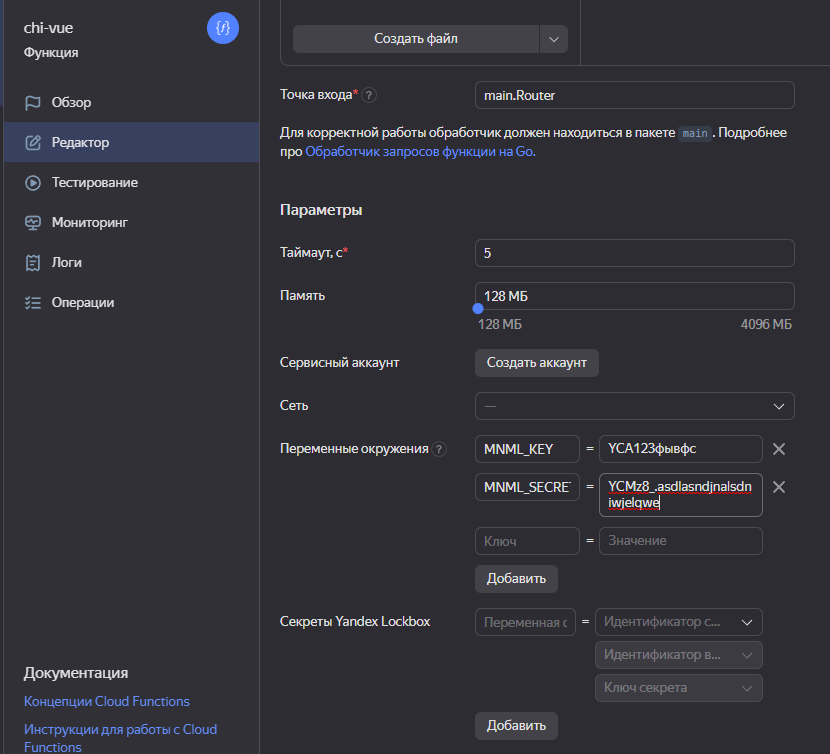
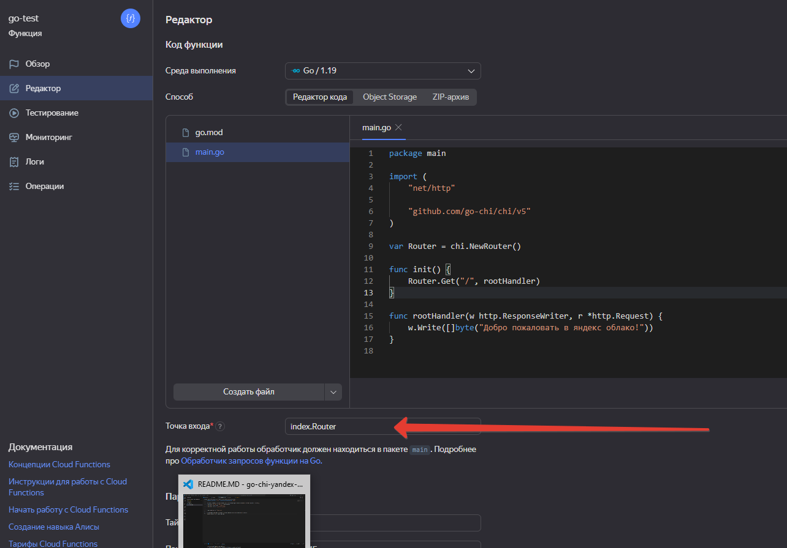
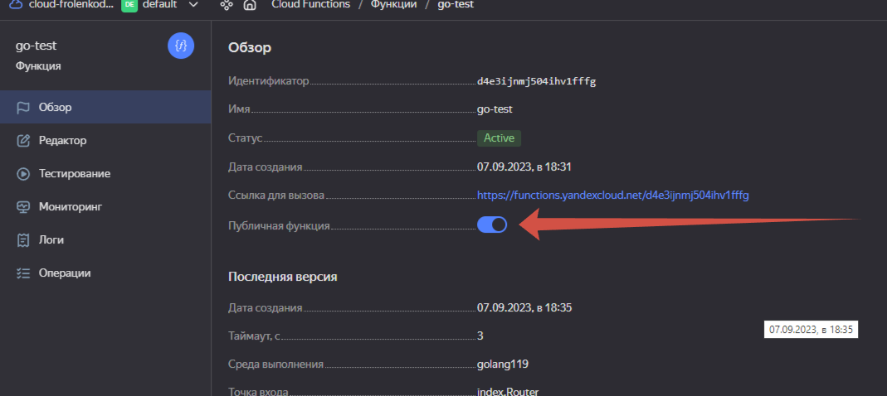
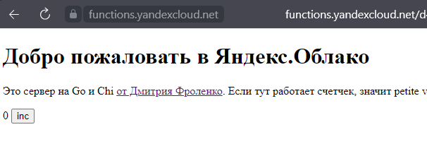
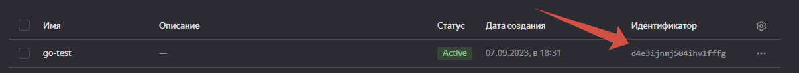
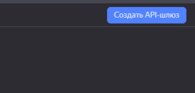
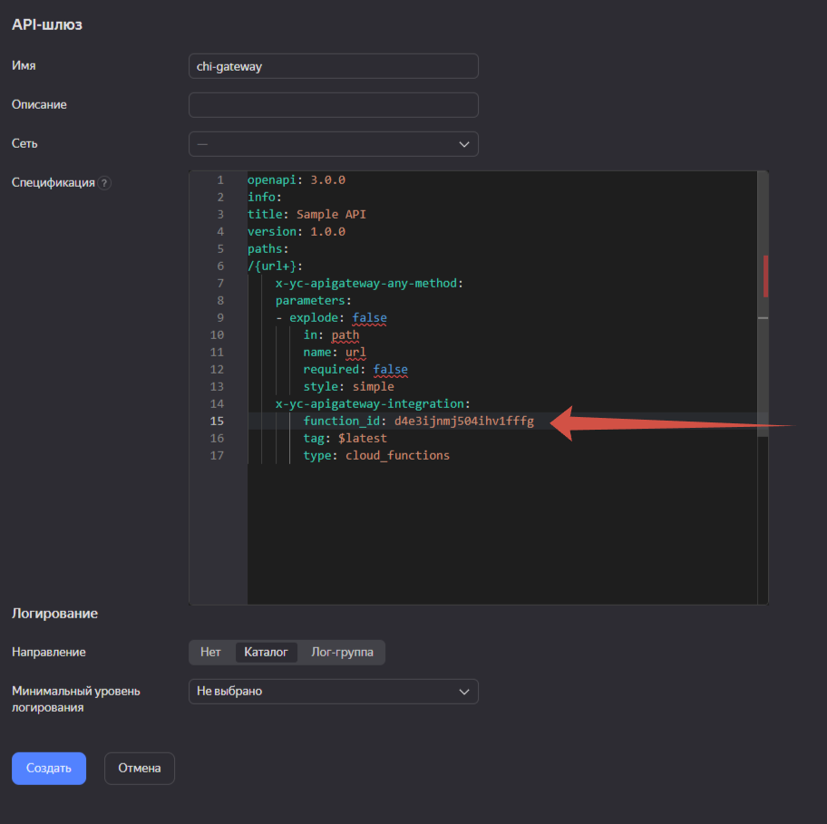
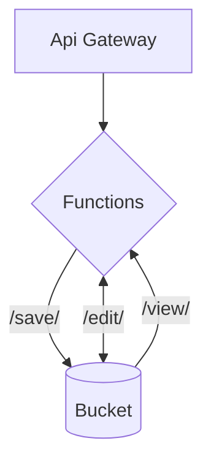

# Редактор файлов в байкете на `Go`

`Petite Vue` + `chi` + `minimal` + `Object storage`
----

Это руководство по библиотеке `mininal`. Пример использования.

## Установка

1. Создайте бакет
2. Создайте функцию
3. Создайте сервисный аккаунт с ролями `storage.editor`

### Настроим все это. 8 минут

1. Загрузите все файлы в вашу функцию(например, [архивом](https://minhaskamal.github.io/DownGit/#/home)) (Для простоты загрузки можете воспользоваться [powershell скриптом](https://github.com/thefrol/powershell-yandexcloud-function-uploader))
1. Создайте сервисный аккаунт с ролью `storage.editor`
  - создайте статичный ключ
  - в переменные окружения функции введите `MNML_KEY` и `MNML` - ключ и секрет полученные в окне
   
1. Поставьте точка входа - `main.Router`
    
2. Поставьте галочку `публичная функция`
    
3. Потом перейдите на `https://functions.yandexcloud.net/d4e3...`(написан там где галочку ставили). Тут должно быть вот так:
      
1. Запомнить идентификатор функции, скопируй или возьми из адреса `https://functions.yandexcloud.net/<идентификатор>`, или в списке всех функций
    
1. Перейдем в сервис `Api Gateway` в яндекс облаке и создадим новый гейт
    
2. Запишем такую конфигурацию в окне создания шлюза, и поменяем строчку `function_id` на полученный в первом пунтке идентификатор

    ```openapi
    openapi: 3.0.0
    info:
      title: Sample API
      version: 1.0.0
    paths:
      /{url+}:
        x-yc-apigateway-any-method:
          parameters:
          - explode: false
            in: path
            name: url
            required: false
            style: simple
          x-yc-apigateway-integration:
            function_id: твой_идентификатор
            tag: $latest
            type: cloud_functions
    ```

    
4. Теперь твоя функция работает по такому адресу `https://d5dphasdln.apigw.yandexcloud.net`, его можно посмотреть в поле служебный домен на открывшейся странице
    

## Готово! 🙌

Теперь можно редактировать файлы из бакета, и просматривать их. 

+ `/view/ваш файл` тут можно посмотреть файл
+ `/edit/файл` а тут отредатировать, или создать новый файл, если ввести адрес ещё не существющего файла, например, `https://118ajlsdasd.apigw.yandexcloud.net/edit/new_file.txt`, папки не поддержвиваются

## Архитектура



## Что дальше?

Форкните на гитхабе и установите себе локально репозиторий, чтобы можно было работать с кодом. 


Ещё вот есть интересный [гайд по git](https://habr.com/ru/articles/541258/) или прекрасный [курс на Яндекс.Практикуме](https://practicum.yandex.ru/git-basics/)

### Установить локально

1. зайдите в папку
2. скачайте в нее репозиторий
    ```bash
    git clone https://github.com/<ваше_имя>/<ваш_репозиторий> .
    ```

### Локальный запуск

Для тестирования предусмотрен локальный запуск. 

```
go run .
```

Сервер будет ждать на `http://localhost:8080`

### Планы

Сделать утилиту по созданию всех штук в бакете
и общий гайд по функции + апигв выделить отдельно
Переделать этот пример в блог

# Автор

За основу взят [шаблон попроще](https://github.com/thefrol/go-chi-yandex-cloud-template)

Дмитрий Фроленко 2023
